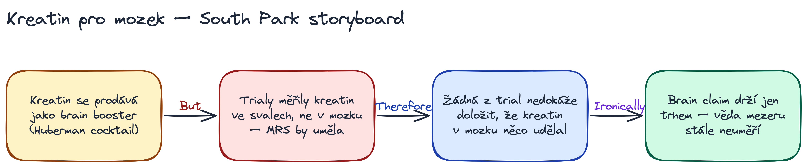

# story-canvas

Claude Code / Gemini CLI skill, který bere **příběh, článek nebo zadání** a renderuje ho jako **Excalidraw storyboard** — sticky-note karty propojené *but/therefore* connector words, ve stylu Matta Stonea a Treye Parkera ("South Park storytelling secret").

Inspirace: [video Zsolt's Visual PKM](https://youtu.be/nUIm3lqwnWU) o vizuálním PKM a storytellingu.



## Co skill umí

- **4 storytelling frameworky**: South Park (default), Pixar Story Spine, Hero's Journey, Save the Cat. Skill sám zvolí podle typu inputu, nebo respektuje uživatelovu volbu.
- **4 vizuální styly**: sticky notes (default), beat sheet (časová osa), Hero's circle, story mountain.
- **Self-review po renderu**: Claude přečte PNG, ověří čitelnost a layout, opraví problémy.
- **Reakce na feedback**: uživatel řekne "změň X" → JSON se přepíše a re-renderuje.
- **Output = `.excalidraw` + `.png`**: editovatelný v Obsidian, sdílitelný jako obrázek.

## Instalace

### Claude Code (Mac/Linux)

```bash
git clone https://github.com/astar/story-canvas.git ~/project/story-canvas
ln -s ~/project/story-canvas ~/.claude/skills/story-canvas

cd ~/project/story-canvas/references
uv sync
uv run playwright install chromium
```

Skill se objeví v dostupných `skills` (jako `story-canvas`). Triggery: pošli článek / příběh / téma a slovo "storyboard", "vizualizuj jako příběh", "rozcvič South Park metodou".

### Gemini CLI

Symlink na `~/.gemini/skills/story-canvas` místo `~/.claude/skills/`.

### Hermes (gpu1)

Skill je pro Claude Code interaktivní pattern (LLM = Claude přímo). Pro autonomní Hermes deployment (Telegram trigger) je třeba doplnit subprocess LLM call — viz `~/.hermes/skills/visualizer/` pro vzor.

## Závislosti

- Python 3.11+
- [uv](https://docs.astral.sh/uv/) (instalace deps)
- Playwright + headless Chromium (renderer)
- (Volitelně) Obsidian Excalidraw plugin pro editaci .excalidraw souborů

## Příklad

```
> rozkresli tenhle článek South Park metodou:
> https://www.drwilliamwallace.com/notes/apigenin-sleep-nad-evidence-review/
```

Skill stáhne článek, identifikuje 5-9 klíčových beats, zvolí connector words (Yet, Therefore, But, Ironically), vyrenderuje sticky-note storyboard a uloží do `~/Obsidian/feynman/Visualizations/YYYY-MM-DD-<slug>.{excalidraw,png}`.

Příklad výstupu v `examples/`.

## Frameworky

| Framework | Když použít | Vizuál default |
|---|---|---|
| **South Park** | evidence-review, op-ed, biografie, většina článků | sticky notes + connectors |
| **Pixar Story Spine** | jednoduché lineární vyprávění | 6 karet horizontálně |
| **Hero's Journey** | mytické/transformační, "od X k Y" | kruh 12 segmentů |
| **Save the Cat** | filmový scénář / long-form | beat sheet s % markery |

## Co skill NEDĚLÁ

- Nevolá externí LLM API (Gemini, OpenAI). Beats generuje Claude přímo skrz SKILL.md prompt.
- Nepublikuje na Telegram / Slack — výstup jen na disku.
- Nemodifikuje existující soubory mimo svůj output adresář.

## Vychází z

- [bradautomates/claude-video](https://github.com/bradautomates/claude-video) — pattern Claude Code skillu s subprocess script + self-loop přes Read tool
- [excalidraw/excalidraw](https://github.com/excalidraw/excalidraw) — kanvas + JSON schéma
- Hermes [visualizer skill](https://github.com/) — pattern LLM → Excalidraw JSON → PNG → vault
- Matt Stone / Trey Parker NYU 2011 přednáška o storytellingu
- [Zsolt's Visual PKM](https://youtu.be/nUIm3lqwnWU) — sticky-notes esthetic

## Licence

MIT
